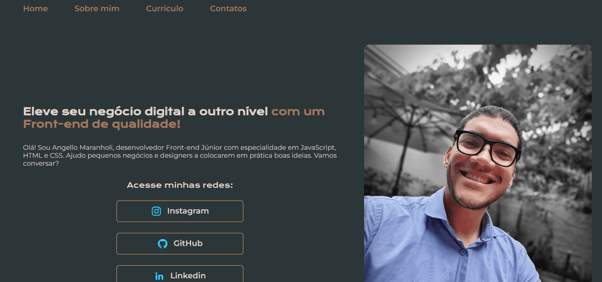

# Minha Primeira LandingPage
## Projeto autoral completo desenvolvido do zero com HTML, CSS e JavaScript
-------------------------------------------------------------------------------------------------------------

### Objetivo: Aplicar e consolidar conhecimentos iniciais de desenvolvimento web, como:

* Estruturação com HTML
* Estilização com CSS
* Interatividade com JavaScript
* Manipulação do DOM
* Lógica de programação

### Tecnologias utilizadas:

- HTML5
- CSS3
- JavaScript
- Git e GitHub
- Vercel

### Lógica do projeto:

- A página foi construída do zero utilizando HTML semântico para organizar o conteúdo
- O CSS foi aplicado para estilizar a interface, definindo cores, espaçamentos e layout
- O JavaScript é responsável por adicionar interatividade, capturando ações do usuário e manipulando elementos da página
- Eventos são utilizados para reagir às interações (como cliques), executando funções que alteram dinamicamente o conteúdo exibido
- A estrutura do código separa responsabilidades entre HTML (estrutura), CSS (estilo) e JavaScript (comportamento), seguindo boas práticas iniciais de desenvolvimento web

Estrutura do projeto:

/primeiro-html-1
├── index.html → estrutura da página
├── style.css → estilização visual
└── script.js → lógica e interações

Acesse o projeto hospedado na plataforma Vercel diretamente pelo navegador:
https://angellomaranholidev.vercel.app/

Diferenciais e Aprendizados:

- Projeto *Autoral* desenvolvido 100% do zero
- Integração prática entre HTML, CSS e JavaScript
- Compreensão da separação de responsabilidades no front-end
- Primeira experiência estruturando um projeto completo
- Evolução na lógica de programação aplicada ao navegador

Preview do projeto:

Autor: Angello Maranholi
